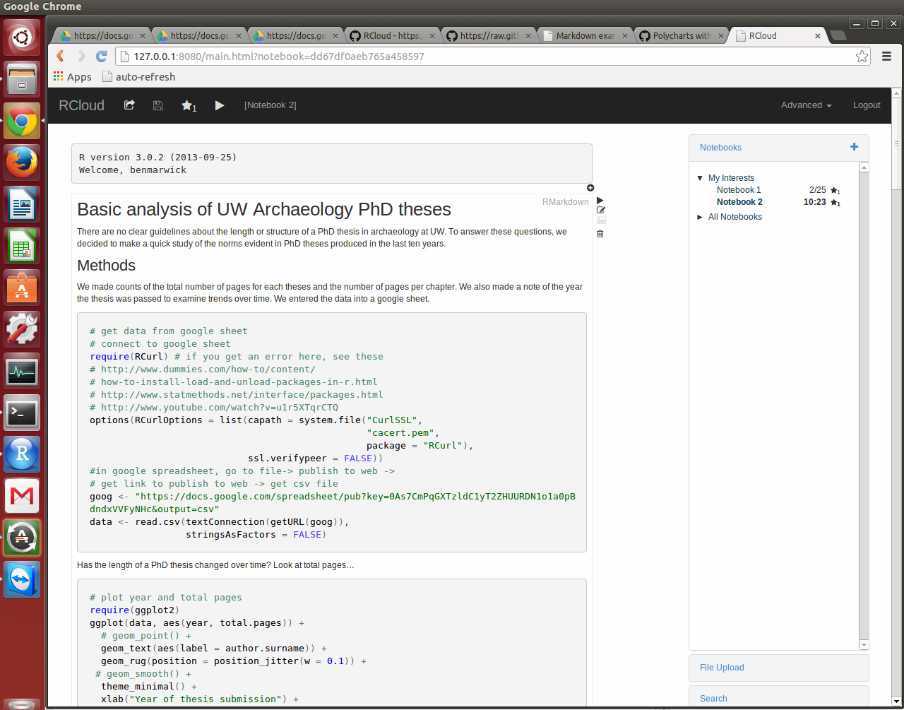
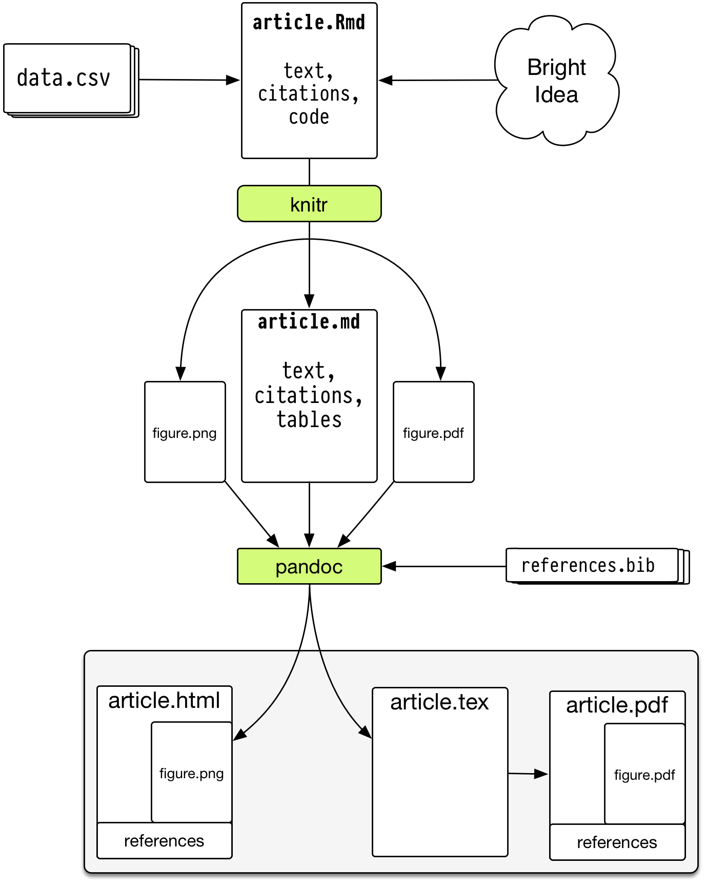
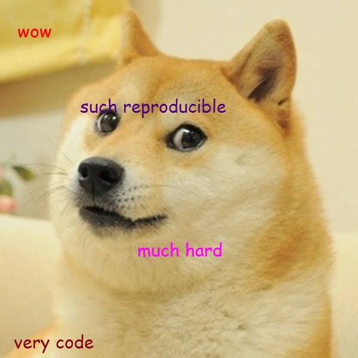

Reproducible Research: A primer for the social sciences
========================================================
author: Ben Marwick
date: March 2014
transition: none
---
ext_widgets : {rCharts: libraries/nvd3}
---

Overview
========================================================
- Definitions, motives, history, spectrum
- Current practices 
- A selection of tools to improve reproducibility 
- Challenges, standards & our role in the future of reproducible research

Definitions
========================================================

*Replicable* refers to the ability to produce **exactly** the same results as published. Other people get exactly the same results when doing exactly the same thing. Technical: cf. validation and verification

*Reproducible* refers to the ability to create a workflow that independently upholds the published results using the information provided. Checking the results from the fixed digital form of data and code from the original study. Something similar happens in other people's hands. Substantive: possibly by a new implementation

<small><small>"The goal of reproducible research is to tie specific instructions to data analysis and experimental data so that scholarship can be recreated, better understood and verified."  - Max Kuhn, CRAN Task View: Reproducible Research </small></small>

History of reproducible research
=======================================================
- Mathematics (400 BC?)
- Write scientific paper, Galileo, Pasteur, etc.  (1660s?)
- Publish a pidgin algorithm and describe simulation datasets (1950s?)
- Sell magtape of code and data (1970s?)
- Place idiosyncratic dataset & software at website (1990s?)
- Publish datasets and scripts at website, eg. biology, political science, genetics, statistics (2000s?)
- Hosted integrated code and data (2020s?)

<small><small>Gavish & Gonoho AAAS 2011, Oxberry 2013</small></small>

Motivations: Claerbout's principle
========================================================

>"An article about computational result is advertising, not scholarship. The actual scholarship is the full software environment, code and data, that produced the result." <small><small>- Claerbout and Karrenbach, Proceedings of the 62nd Annual International Meeting of the Society of Exploration Geophysics. 1992</small></small>

>"When we publish articles containing figures which were generated by computer, we also publish the complete software environment which generates the figures" <small><small>- Buckheit & Donoho, Wavelab and Reproducible Research, 1995.</small></small>

Benefits are straightforward
=======================================================
- **Verification & Reliability**: Easier to find and fix bugs. The results you produce today will be the same results you will produce tomorrow.
- **Transparency**: Leads increased citation count, broader impact, improved institutional memory
- **Efficiency**: Reuse allows for de-duplication of effort. Payoff in the (not so) long run
- **Flexibility**: When you don’t 'point-and-click' you gain many new analytic options.

But the limitations are substantial
=======================================================
Technical
- Classified/sensitive/big data
- Nondisclosure agreements & intellectual property 
- Software licensing issues
- Competition
- Neither necessary nor sufficient for correctness (but essential for dispute resolution)

***

Cultural & personal 
- Very few researchers follow even minimal reproducibility standards.
- No-one expects or requires reproducibility 
- No uniform standards of reproducibility, so no established user base
- Inertia & embarassment

Our work exists on a spectrum of reproducibility
=======================================================

<small><small>Peng 2011, Science 334(6060) pp. 1226-1227</small></small>

Goal is to expose the reader to more of the research workflow
=======================================================

<small><small><small>http://www.stodden.net/AMP2011/slides/pengslides.pdf</small></small></small>

Current practices, or ethnographic observations of social science research workers
========================================================
type: alert


========================================================
- Enter data in Excel
- Use Excel for data cleaning & descriptive statistics
- Import data into SPSS/SAS/Stata for further analysis
- Use point-and-click options to run statistical analyses
- Copy & paste output to Word document, repeatedly

***


========================================================
- Version control is ad hoc
- Excel handles missing data inconsistently and sometimes incorrectly 
- Excel uses poor algorithms for many functions
- Scripting is possible but rare 


***


Click trails are ephemeral & dangerous
========================================================
- Lots of human effort for tedious & time-wasting tasks
- Error-prone due to manual & ad hoc data handling (column and row offsets are common)
- Difficult to record -  hard to reconstruct a 'click history'
- Tiny changes in data or method require extensive reworking efforts

***


Case study: Reinhart and Rogoff controversy
========================================================
`
 
`


***

`
`
- Claimed that higher debt-to-G.D.P. ratios are associated with lower levels of G.D.P. growth
- Identified the threshold to -ve growth at a debt-to-G.D.P. ratio of >90%
- Substantial popular impact on autsterity politics 


Case study: Reinhart and Rogoff controversy
========================================================


Scripted analyses are superior
========================================================


***

- Plain text files will be readable for a long time
- Improved transparency, automation, maintanability, accessibility, standardisation, modularity, portability, efficiency, communicability of process (what more could we want?)
- But there's a steep learning curve 

A selection of my favourite tools for reproducible research (which also seem to be widely used by others in the social sciences)
========================================================
type: alert

Literate statistical programming 
========================================================
>"Instead of imagining that our main task is to instruct a computer what to do, let us concentrate rather on explaining to humans what we want the computer to do."-- <small><small>Donald E. Knuth, Literate Programming, 1984</small></small>

***

For example...
Let's calculate the current time in R.

```r
time <- format(Sys.time(), "%a %d %b %X %Y")
```

The text and R code are interwoven in the output:

The time is `` `r time` ``

The time is Wed 12 Mar 12:11:31 PM 2014


Literate programming: for and against 
========================================================
For
- Text and code all in one place, in logical order
- Tables and figures automatically updated to reflect data and method changes
- Automatic test when building document

Against
- Text and code all in one place; can be hard to read sometimes, especially if there is a lot of code
- Can substantially slow down the processing of documents
(although caching can help)


Need a programming language
========================================================
The machine-readable part

R: Free, open source, cross-platform, highly interactive, huge user community in academica and private sector

R packages: an ideal 'Compendium'?


***

>"both a container for the different elements that make up the document and its computations (i.e. text, code, data, etc.), and as a means for distributing, managing and updating the collection... allow us to move from an era of advertisement to one where our scholarship itself is published" <small><small>- Gentleman and Temple Lang 2004</small></small>


Very low barrier to documentation of code with roxygen2
========================================================


Interactive charts in the browser with the rCharts package
========================================================
<iframe src='
CSSS_WI14_Reproducibility-figure/nvd3plot1.html
' scrolling='no' seamless class='rChart 
nvd3
 '
id=iframe-
chart1f60b312880
></iframe>
<style>iframe.rChart{ width: 100%; height: 400px;}</style>


Interactive charts in the browser with the rCharts package
========================================================
<iframe src='
CSSS_WI14_Reproducibility-figure/nvd3plot2.html
' scrolling='no' seamless class='rChart 
nvd3
 '
id=iframe-
chart1f6038cb1110
></iframe>
<style>iframe.rChart{ width: 100%; height: 400px;}</style>


Interactive notebook in the browser, IPython-style
========================================================
```
library(rCharts)
open_notebook()
```


RCloud, another IPython-style R notebook
========================================================



Need a document formatting language
========================================================
`
 
`


Markdown: lightweight document formatting syntax
based on email text formatting. Easy to write, read and publish as-is.

***
The human-readable part

rmarkdown: 
- minor extensions to allow R code display and execution
- embed images in html files (convenient for sharing)
- equations

Dynamic documents in R
========================================================
knitr - descendant of Sweave  

Engine for dynamic report generation in R


***

- Narrative and code in the same file or explicitly linked
- When data or narrative are updated, the document is automatically updated
- Data treated as 'read only'
- Output treated as disposable

Pandoc converts output from rmarkdown in many popular formats
========================================================
`
`

A universal document converter, open source, cross-platform

-> Write code and narrative in rmarkdown   
-> use knitr to get markdown (with computation of figures and tables)   
-> use pandoc to get HTML/PDF/DOCX

...with a single R function `render` 

***
`
`


<small><small><small>http://kieranhealy.org/blog/archives/2014/01/23/plain-text/ </small></small></small>

Tracking changes with version control 
========================================================
Payoffs
- Eases collaboration
- Can track changes in any file type (ideally plain text), and who made them
- Can revert file to any point in its tracked history

Costs
- Unfamiliar to most social scientists 
- Takes time to master

***


Environment for reproducible research
========================================================
RStudio is a free, open source, cross-platform integrated development environment for R

Has an integrated R console, deep support for markdown and git, a file manager, a text editor, a workspace browser, a data viewer, package development tools, etc. etc.

RStudio 'projects' make version control & document preparation simple

***


Depositing code and data
========================================================
Payoffs
- Free space for hosting (and paid options)
- Assignment of persistent DOIs
- Tracking citation metrics 

Costs
- Sometimes license restrictions (CC-BY & CC0)
- Limited or no private storage space

***


A hierarchy of reproducibility 
========================================================
- **Good**: Use code with an integrated development environment (IDE). Minimize pointing and clicking (RStudio)
- **Better**: Use version control. Help yourself keep track of changes, fix bugs and improve project management (RStudio & Git & GitHub or BitBucket)
- **Best**: Use embedded narrative and code to explicitly link code, text and data, save yourself time, save reviewers time, improve your code. (RStudio & Git & GitHub or BitBucket & rmarkdown & knitr & data repository)


========================================================
type: alert

Problems, standards & our role in the future
---

***




========================================================

<small><small>Stodden (IASSIST 2010) sampled American academics registered at the Machine Learning conference NIPS (134 responses from 593 requests (23%). Red = communitarian norms, Blue = private incentives</small></small>


========================================================

<small><small>Stodden (IASSIST 2010) sampled American academics registered at the Machine Learning conference NIPS (134 responses from 593 requests (23%). Red = communitarian norms, Blue = private incentives</small></small>


Standards to normalise reproducible research
========================================================
- Schwab et al.: ER (Easily reproducible), CR (Conditionally reproducible), NR (Not reproducible)
- _Biostatistics_ kite-marking of articles (Peng 2009): D (data), C (code), R (both)
- Reproducible Research Standard (Stodden 2009): we should release 
 - The full compendium on the internet
 - Media such as text, figures, tables with Creative Commons Attribution license (CC-BY) 
 - Code with one of Apache 2.0, MIT, LGPL, BSD, etc.
 - Original "selection and arrangement" of data with CC0 or CC-BY

Culture change is the biggest challenge
========================================================
- Promote culture change through positive attribution 
- Implement mechanisms to indicate & encourage **degrees of compliance** (ie. easily identifiable logo & clear definitions for different levels of reproducibility):
 - **'Reproducible'**: compendium of text-code-data online
 - **'Reproduced'**: compendium available and independently reproduced 
 - **'Semi-Reproducible'**: when the full compendium is not released
 - **'Semi-Reproduced'**: independent reproduction with other data
 - **'Perpetually Reproducible'**: streaming data
 
Our role in the future of reproducible research
========================================================
incremental: true
- Train students by putting homework, assignments & dissertations on the reproducible research spectrum
- Publish examples of reproducible research in our field
- Request code & data when reviewing
- Submit to & review for journals that support reproducible research
- Critically review & audit data management plans in grant proposals
- Consider reproducibility wherever possible in hiring, promotion & reference letters.

Thanks! 
========================================================
>"Abandoning the habit of secrecy in favor of process transparency and peer review was the crucial step by which alchemy became chemistry."
---
<small><small>-Raymond, E. S., 2004, The art of UNIX programming: Addison-Wesley.</small></small>


Colophon
========================================================
Presentation written in [Markdown](http://daringfireball.net/projects/markdown/) ([R Presentation](http://www.rstudio.com/ide/docs/presentations/overview))

Compiled into HTML5 using [RStudio](http://www.rstudio.com/ide/)

Source code hosting:
https://github.com/benmarwick/CSSS-Primer-Reproducible-Research

ORCID: http://orcid.org/0000-0001-7879-4531

Licensing: 

* Presentation: [CC-BY-3.0 ](http://creativecommons.org/licenses/by/3.0/us/)

* Source code: [MIT](http://opensource.org/licenses/MIT) 

References
========================================================
See Rpres file on [github](https://github.com/benmarwick/CSSS-Primer-Reproducible-Research) for full references


