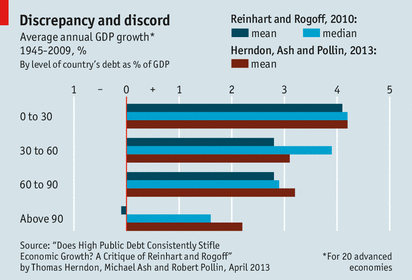

Reproducible Research: A primer for the social sciences
========================================================
author: Ben Marwick
date: February 2014
---
ext_widgets : {rCharts: libraries/nvd3}
---

Motivations
========================================================

>"An article about computational result is advertising, not scholarship. The actual scholarship is the full software environment, code and data, that produced the result." <small>- Claerbout and Karrenbach, Proceedings of the 62nd Annual International Meeting of the Society of Exploration Geophysics. 1992</small>

>"When we publish articles containing figures which were generated by computer, we also publish the complete software environment which generates the figures" <small>- Buckheit & Donoho, Wavelab and Reproducible Research, 1995.</small>


Benefits
=======================================================
- Verification & Reliability: Easier to find and fix bugs. The results you produce today will be the same results you will produce tomorrow.
- Transparency: Leads increased citation count, broader impact, improved institutional memory
- Efficiency: Via de-duplication of effort. Payoff in the (not so) long run
- Flexibility: When you don’t 'point-and-click' you gain many new analytic options.

Restrictions
=======================================================
- Classified or sensitive data
- Nondisclosure agreements
- Software licensing issues
- Inertia

Spectrum of reproducibility
=======================================================

<small>Peng 2011, Science 334(6060) pp. 1226-1227</small>

Research pipeline
=======================================================

<small>http://www.stodden.net/AMP2011/slides/pengslides.pdf</small>

Common practice in social sciences
========================================================
- Enter data in Excel
- Use Excel for data cleaning, etc
- Generate descriptive statistics (counts,means, etc) in Excel
- Import data into SPSS/SAS/Stata for analysis
- Use point-and-click options to run statistical analyses
- copy-paste output to Word document

***

- Missing data are handled inconsistently and sometimes incorrectly
- Excel uses poor algorithms for many functions
- Excel does not treat tied observations correctly when ranking
- Scripting is possible but rare 

Click trails are ephemeral 
========================================================
- GUIs and copy-paste are bad for reproducibility 
- A lot of manual & ad hoc data handling
- Leaves no trace - no audit trail
- Difficult to document
- Difficult to remember

***


Reinhart and Rogoff controversy
========================================================
- Claimed that higher debt-to-G.D.P. ratios are associated with lower levels of G.D.P. growth
- Identified the threshold to -ve growth at a debt-to-G.D.P. ratio of >90%
- Substantial impact on autsterity politics 
- Reanalysis identified no threshold and +2.2% at >90%

***


Reinhart and Rogoff controversy
========================================================



Scripted analyses endure
========================================================


***

Plain text files and UTF-8 encoding will be readable for a long time

They are much more accessible

Literate statistical programming 
========================================================
>"Instead of imagining that our main task is to instruct a computer what to do, let us concentrate rather on explaining to humans what we want the computer to do."-- Donald E. Knuth, Literate Programming, 1984

***

For example...
Let's calculate the current time in R.

```r
time <- format(Sys.time(), "%a %b %d %X %Y")
```

The text and R code are interwoven in the output:

The time is `` `r time` ``

The time is Sat Feb 15 2:52:38 AM 2014

Advantages and disadvantages
========================================================
Advantages of switching to literate programming
- Text and code all in one place, in logical order
- Data, results automatically updated to reflect external changes
- Automatic test when building document

Some disadvantages
- Text and code all in one place; can be hard to read sometimes, especially if there is a lot of code
- Can substantially slow down the processing of documents
(although caching can help)

Need a programming language
========================================================
Machine-readable

R: Free, open source, cross-platform, highly interactive, huge user community

R packages: the ideal 'Compendium'


***

>both a container for the different elements that make up the document and its computations (i.e. text, code, data, etc.), and as a means for distributing, managing and updating the collection... allow us to move from an era of advertisement to one where our scholarship itself is published <small>- Gentleman and Temple Lang 2004</small>

========================================================
Very low barrier to documentation of code with roxygen2


Need a document formatting language
========================================================


Markdown: lightweight, human-readable document formatting syntax
based on email text formatting

***

R Markdown: minor extensions to allow R code display and execution, embed images in html files (convenient for sharing), equations

One package to rule them all
========================================================
knitr - descendant of Sweave


***

'dynamic documents' put narrative and code in the same location

When data or narrative are updated, the document is automatically updated


Version control
========================================================
Payoffs
- Eases collaboration
- Can track changes in any file type, and who made them
- Can revert file to any point in its tracked history

Costs
- unfamiliar to most social scientists 
- Takes a very long time to master

***


Environment for reproducible research
========================================================
RStudio has integrated R console, support for markdown and git

RStudio 'projects' make version control trivial

***


Interactive charts in the browser with the rCharts package
========================================================
<iframe src='
CSSS_WI14_Reproducibility-figure/nvd3plot1.html
' scrolling='no' seamless class='rChart 
nvd3
 '
id=iframe-
chart1b781f1440de
></iframe>
<style>iframe.rChart{ width: 100%; height: 400px;}</style>


Interactive charts in the browser with the rCharts package
========================================================
<iframe src='
CSSS_WI14_Reproducibility-figure/nvd3plot2.html
' scrolling='no' seamless class='rChart 
nvd3
 '
id=iframe-
chart1b78530938e3
></iframe>
<style>iframe.rChart{ width: 100%; height: 400px;}</style>


Interactive notebook in the browser, iPython-style
========================================================
```
library(rCharts)
open_notebook()
```


The Hierarchy of Code Reproducibility 
========================================================
- Good: Use an integrated development environment (IDE). Keep your code in one place, let it do what it’s supposed to. (RStudio)
- Better: Use version control. Help yourself keep track of changes, fix bugs and improve project management (Git & GitHub or BitBucket)
- Best: Use embedded code. Explicitly link code and text, save yourself time, save reviewers time, improve your code. (R Markdown & knitr)


Releasing output into the wild
========================================================
pandoc

A universal document converter

Easily convert markdown file to many formats (HTML, PDF, DOCX, etc)

***

Depositing Paper, code and data
========================================================
>Payoffs

- Free space for hosting
- Assignment of persistent DOIs
- Tracking citation metrics (FigShare, ORCID)

>Costs

- Sometimes license restrictions
- Limited or no private storage space

***


Ongoing problems
========================================================
- Reproducing big data and supercomputing research is hard
- Making sure that source code works on other people's computers
is hard
- Keeping detailed enough records is hard

Changing the culture and reward structure
========================================================
- Significant discipline and effort required

Colophon
========================================================
Presentation written in Markdown

Compiled into HTML using RStudio

Source code hosting:
https://github.com/benmarwick/CSSS-Primer-Reproducible-Research

FigShare DOI:

ORCID: http://orcid.org/0000-0001-7879-4531

Licensing: 

* Presentation: CC-BY-3.0 

* Source code: MIT 

References
========================================================
See Rpres file for full references


